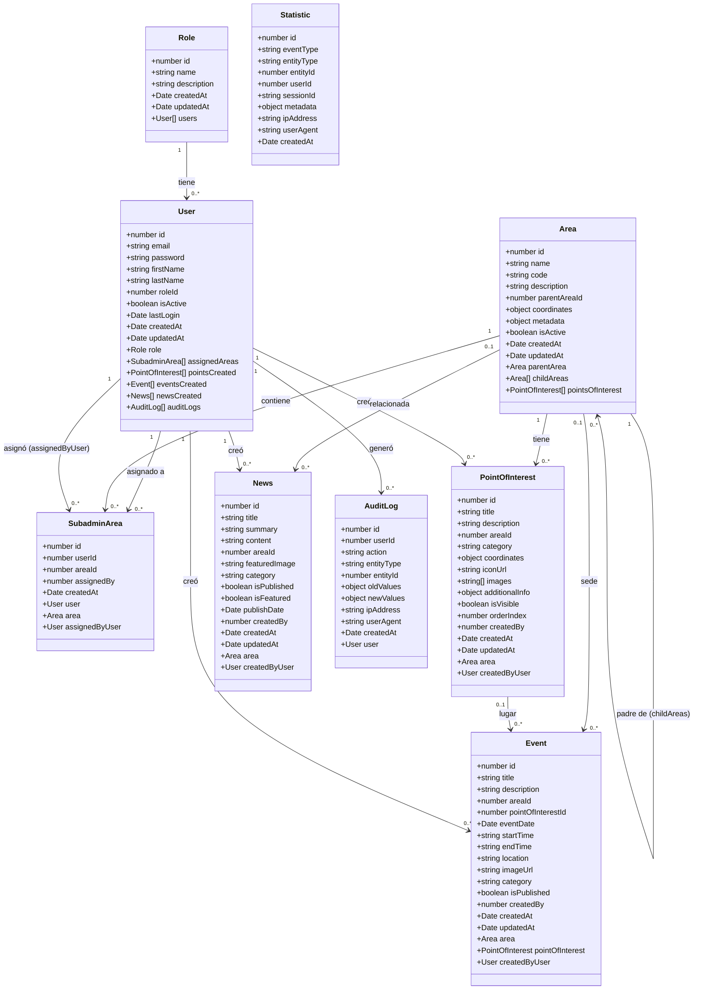

# Diagrama de Clases — Proyecto Final

## Entidades del Backend (NestJS + TypeORM)

## Descripción de Relaciones

| Entidad Origen | Relación | Entidad Destino | Tipo |
|---|---|---|---|
| `Role` | tiene → | `User` | OneToMany |
| `User` | tiene asignadas → | `SubadminArea` | OneToMany |
| `Area` | contiene → | `SubadminArea` | OneToMany |
| `Area` | tiene → | `PointOfInterest` | OneToMany |
| `User` | creó → | `PointOfInterest` | OneToMany |
| `Area` | sede de → | `Event` | OneToMany |
| `PointOfInterest` | lugar de → | `Event` | OneToMany |
| `User` | creó → | `Event` | OneToMany |
| `Area` | relacionada con → | `News` | OneToMany |
| `User` | creó → | `News` | OneToMany |
| `User` | generó → | `AuditLog` | OneToMany |
| `Area` | padre de → | `Area` | Self-referential ManyToOne |
